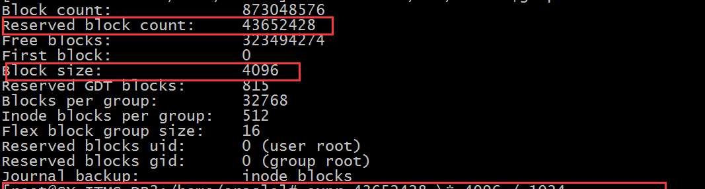
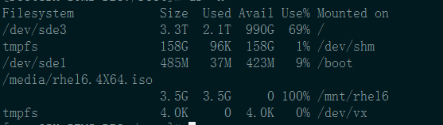

前些天现场的某台Oracle DB Server的磁盘可用空间每天莫名减少1%，排查过程着实费了不少功夫，特记录下来作为知识和经验的积累。

简要说下现象，现场维护工程师报告某生产系统Oracle DB Server的/卷可用空间每天减少1%，使用量已超过80%触发系统告警。维护工程师经过排查没有发现异常。于是寻求后端工程师支持。

这个问题本来认为并不复杂，既然每天都增长1%，由于/卷的总容量是3.3T，那么1%就是30G左右，是一个很大的变化，那我们只要比较前后2天的/卷下所有子目录的使用量变化，就能找到是哪个子目录在增长。

- 前后2天分别在相同时间运行以下命令
  - 首先使用 `df -m` - 查看磁盘整体使用量，第一天忘记截图了，/目录 use%=81%，下图是第二天的截图,增长到了82%
  

  
  - 然后使用 `du -s -m * > yyyymmdd.out`保存子目录的使用量
  - 使用 `diff` 比较前后2天的输出文件，诡异的事情发生了，所有子目录的使用量没有变化。

那么是谁偷了1%近30G左右的空间呢？

虽然问题还没有找到，但是发现一个问题，就是`df -m`命令输出的结果中，total size > used + availabe, 在我们的系统中
`3356832 - 2582069 - 604246 = 170517 MB` 有160GB左右的偏差，这是为什么呢？

通过上网查资料发现，原来Linux系统有个保留空间的概念，保留空间主要有以下作用：

1. 减少Linux文件系统碎片; 
2. 在磁盘分区没有剩余空间的时候.,root用户也可以登陆维护,或者系统记录日志.

如何查看系统的保留空间是多大呢？通过下面的命令
`#tune2fs -l <device> | grep -i block` ，输出内容如下图所示：

将图中reserved block count * block size就得出了保留空间的大小： 
` 43652428 * 4096/1024/1024 = 170517 MB`, 恰好等于前面计算出的容量偏差。

继续研究每天1%的空间占用原因。在上面查找空间偏差相关资料的时候，有些文章提到了linux 中df命令和du命令工作机制不同进而引起2个命令统计的结果不一致的问题。下面直接饮用网上的资料说明：

- df 和du 的工作原理
  - du的工作原理
du命令会对待统计文件逐个调用fstat这个系统调用，获取文件大小。它的数据是基于文件获取的，所以有很大的灵活性，不一定非要针对一个分区，可以跨越多个分区操作。如果针对的目录中文件很多，du速度就会很慢了。
  - df的工作原理
df命令使用的事statfs这个系统调用，直接读取分区的超级块信息获取分区使用情况。它的数据是基于分区元数据的，所以只能针对整个分区。由于df直接读取超级块，所以运行速度不受文件多少影响。
- du和df不一致情况模拟
常见的df和du不一致情况就是文件删除的问题。当一个文件被删除后，在文件系统 目录中已经不可见了，所以du就不会再统计它了。**然而如果此时还有运行的进程持有这个已经被删除了的文件的句柄，那么这个文件就不会真正在磁盘中被删除， 分区超级块中的信息也就不会更改。这样df仍旧会统计这个被删除了的文件。**

  上面这段粗体文字引起了我们的注意，于是立马行动，通过以下命令排查有哪些文件被删除了但是还没某个进程持有它的文件句柄。
` lsof | grep -i delete` ，功夫不负有心人,终于发现了这个僵尸文件，如下图：

  
   继续查找70843进程是哪个进程
`ps -ef|grep 70843` ， 如下图

当天是3月20日，竟然有一个2月26日的倒库命令还在运行，并产生了近400GB的log文件，并且在不断增长。现场维护人员可能发现了磁盘使用量异常增长并发现了这个log文件，就直接rm了，但没想到还有一个进程关联着这个log文件，导致了磁盘空间莫名增长，但du命令又看不出任何问题。

当把这个异常倒库进程kill后，世界恢复了平静。

一下子释放了400GB空间，爽啊。

通过这次排查，学到了不少东西，特记录。

EOF

